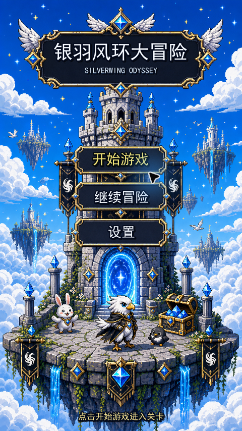
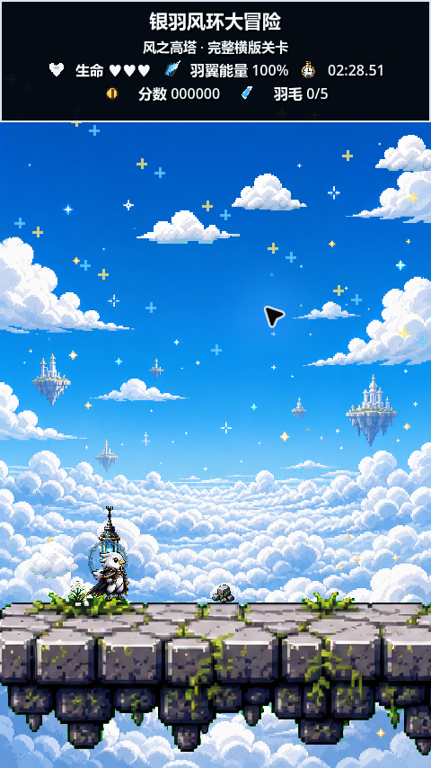

# 银羽风环大冒险 Beta 0.2

Godot 4.x / GDScript 制作的最小可玩 2D 横版平台 Demo。

## 当前进度

当前版本是 **Beta 0.2**：竖屏横版平台核心流程、开始界面、第一关和第二关流转已经跑通，当前重点是继续打磨关卡节奏、美术一致性与角色动作。

- 可运行入口：`scenes/StartMenu.tscn`。
- 核心关卡：`scenes/Main.tscn`；第一关读取 `scenes/levels/Level01Editable.tscn`，通关后进入数据驱动的第二关“云桥花园 · 浮云试炼”。
- 玩家能力：移动、跳跃、滑翔、持续疾跑、下蹲、掉落重生、生命归零失败。
- 关卡目标：至少收集 5 根羽毛后，到右侧高塔终点传送门通关；收集第 5 根羽毛不会自动通关。
- 可编辑内容：第一关平台、羽毛、金币、出生点、传送门、检查点可在 Godot 2D 编辑器里拖动。
- 跟随平台的装饰：草丛、晶体、花、石块、终点塔楼、NPC、奖励宝箱会根据平台名自动归位。
- 音频状态：开始界面和两关统一使用 `Pixel Dungeon` 循环主旋律，菜单、移动、收集、传送门与宝箱使用 16-bit 风格 SFX。

## 如何运行

1. 使用 Godot 4.x 打开项目根目录。
2. 确认主场景为 `scenes/StartMenu.tscn`。
3. 点击编辑器右上角运行按钮。
4. 开始界面只允许点击“开始游戏”进入关卡。

本机测试使用 Godot `4.7.stable`。项目设置是竖屏比例 `480x854`。

## 给下一轮 GPT 分析的重点

如果把仓库交给 GPT 分析，建议优先看这些文件：

- `README.md`：当前总览。
- `docs/PROJECT_REVIEW.md`：上一轮项目审查和重构说明。
- `docs/LEVEL_EDITING_GUIDE.md`：第一关可视化编辑方式。
- `docs/PLAYTEST_CHECKLIST.md`：人工测试清单。
- `scenes/levels/Level01Editable.tscn`：第一关可编辑平台和点位。
- `scripts/Main.gd`：关卡生成、装饰归位、胜利/失败流程。
- `scripts/Player.gd`：移动、跳跃、滑翔、疾跑、下蹲和掉落逻辑。
- `scripts/AudioManager.gd`：BGM/SFX 入口。

当前已知设计取舍：

- `portal_right -> tower_step_a` 的平台间距偏大，是为了保留一点挑战性，暂时不要自动改短。
- 部分美术仍是生成素材/占位素材，重点先看风格一致性和功能可读性。
- 当前主旋律已接入并循环播放，后续重点检查音量平衡、循环衔接和场景切换连续性。

## 文件结构

```text
silverwing_wind_ring_demo/
  project.godot
  README.md
  scenes/
    StartMenu.tscn
    Main.tscn
    levels/
      Level01Editable.tscn
  scripts/
    StartMenu.gd
    Main.gd
    Player.gd
    HUD.gd
    Collectible.gd
    Coin.gd
    NextLevelPortal.gd
    RewardChest.gd
    Checkpoint.gd
    AudioManager.gd
    SaveManager.gd
    data/
      LevelData.gd
    editor/
      EditableLevelRoot.gd
      EditableLevelPoint.gd
      EditablePlatform.gd
  assets/
    characters/
    npcs/
    environment/
    collectibles/
    ui/
    backgrounds/
    effects/
    audio/
    title/
  docs/
    PIXEL_ART_ASSET_LIST.md
    PROJECT_REVIEW.md
    PLAYTEST_CHECKLIST.md
    RELEASE_CHECKLIST.md
    LEVEL_EDITING_GUIDE.md
    START_MENU_ART_BREAKDOWN.md
    START_MENU_LAYOUT_GUIDE.md
    art/
      start_menu_generated_source_v1.png
      start_menu_full_preview_v1.png
      start_menu_parts_contact_sheet_v1.png
      start_menu_parts/
      silverwing_art_direction_v1.png
      silverwing_missing_texture_sheet_v3_source.png
      missing_texture_asset_preview_v3.png
```

## 操作

- A / ←：向左移动
- D / →：向右移动
- Space / W / ↑：跳跃
- 下落时按住 Space：短暂滑翔
- 按住方向键 + Shift / J：持续疾跑，消耗羽翼能量
- S / ↓：下蹲，移动速度降低并更快恢复羽翼能量

## 目标

从左侧起点出发，穿过中段浮空平台，收集至少 5 根羽毛，抵达右侧高塔终点的下一关传送门，触发“恭喜通关”。

## 启动流程

- 项目入口现在是 `scenes/StartMenu.tscn`。
- 开始界面使用参考图同款竖屏像素主视觉，只有点击“开始游戏”才会进入 `scenes/Main.tscn`。
- 开始界面素材位于 `assets/title/start_menu_background_v1.png`。

## 截图





## 当前关卡

- 左侧：起点平台。
- 中段：多段浮空平台，玩家需要跳跃和滑翔通过。
- 中央：风环视觉地标，不触发通关。
- 右侧：高塔终点、下一关传送门、NPC 和奖励宝箱。
- 背景：使用 `ParallaxBackground` 和多层 `ParallaxLayer` 生成远景高塔与云海。

当前主角、平台、云海、小云、远景装饰、高塔、传送门、收集物与 HUD 图标已经接入生成像素贴图；地图内文字牌已移除，避免破坏画面统一性。

## 文档

- `docs/PIXEL_ART_ASSET_LIST.md`：正式像素美术资源清单、尺寸、帧数、动画状态、命名规范和目录。
- `docs/PROJECT_REVIEW.md`：项目审查、重构说明和关卡可达性分析。
- `docs/PLAYTEST_CHECKLIST.md`：v0.1-demo 人工测试清单。
- `docs/RELEASE_CHECKLIST.md`：版本发布前检查、导出建议和 GitHub Release 模板。
- `docs/LEVEL_EDITING_GUIDE.md`：第一关平台、羽毛、金币、出生点、传送门和检查点的可视化微调说明。
- `docs/START_MENU_ART_BREAKDOWN.md`：开始界面资源拆分、单独部件截图路径和 Godot 接入说明。
- `docs/START_MENU_LAYOUT_GUIDE.md`：如何在 Godot 编辑器里微调开始界面文字、点击区域和贴图节点位置。
- `docs/art/start_menu_generated_source_v1.png`：开始界面 AI 生成源图。
- `docs/art/start_menu_full_preview_v1.png`：带标题和菜单文字的开始界面完整预览。
- `docs/art/start_menu_parts_contact_sheet_v1.png`：开始界面关键部件总览。
- `docs/art/start_menu_parts/`：天空云海、标题牌、按钮组、塔楼传送门、角色宝箱、前景浮岛、文字层的单独截图。
- `docs/art/silverwing_art_direction_v1.png`：根据参考图生成的当前美术方向稿。
- `docs/art/silverwing_missing_texture_sheet_v3_source.png`：本轮补齐贴图的生成源稿。
- `docs/art/missing_texture_asset_preview_v3.png`：新增贴图总览，便于检查风格统一性。
- `docs/art/platform_unified_sheet_v5_source.png`：本轮统一浮空平台生成源稿。
- `docs/art/platform_unified_ingame_preview_v5.png`：按关卡实际缩放和碰撞顶面对齐的平台预览。

## 已接入生成美术

- `assets/characters/hero_silverwing_*.png`：主角 idle/run/jump/fall/glide/celebrate 透明帧。
- `assets/characters/hero_silverwing_dash_*.png`、`hero_silverwing_crouch_*.png`、`hero_silverwing_fail_*.png`：疾跑、下蹲和失败动画帧。
- `docs/art/hero_motion_refinement_sheet_v4_source.png`：本轮主角动作细化源稿。
- `docs/art/hero_motion_refinement_preview_v4.png`：主角动作帧预览。
- `assets/environment/portal_next_level_idle_00.png`：右侧下一关传送门。
- `assets/environment/marker_wind_ring_00.png`：中央风环视觉地标。
- `assets/environment/prop_wind_banner_00.png`：黑白凤凰旗帜。
- `assets/npcs/npc_bird_cheer_*.png`、`npc_rabbit_cheer_*.png`、`npc_hood_cheer_*.png`：终点欢呼 NPC 动画帧。
- `assets/collectibles/collect_feather_spin_*.png`：羽毛收集物旋转动画。
- `assets/collectibles/collect_coin_spin_*.png`：金币收集物旋转动画。
- `assets/collectibles/chest_reward_closed_02.png`、`chest_reward_open_01.png`：可交互终点宝箱。
- `assets/ui/ui_icon_*.png`：HUD 图标。
- `assets/effects/fx_confetti_*.png`、`fx_star_sparkle_*.png`、`fx_reward_sparkle_*.png`、`fx_sky_star_*.png`：胜利、宝箱和天空星点粒子。
- `assets/environment/platform_unified_*.png`：当前关卡实际使用的统一风格浮空平台。
- `assets/environment/tile_stone_ground_*.png`、`platform_stone_chunk_*.png`：备用精细石块 tile/平台块变体。
- `assets/environment/prop_grass_tuft_*.png`、`prop_flower_cluster_*.png`、`prop_rock_cluster_*.png`、`prop_chain_arch_00.png`、`prop_crystal_post_*.png`：平台小装饰，降低关卡重复感。
- `assets/environment/platform_unified_tower_cap_00.png`：终点区域专用统一风格薄平台。
- `assets/backgrounds/bg_*.png`：蓝天白云、云海、小云和远景浮空装饰背景元素。
- `assets/backgrounds/bg_blue_sky_clouds.png`：同款亮蓝天白云主背景。
- `assets/backgrounds/bg_cloud_small_*.png`：贴图化小云，替换原先代码绘制的小云。
- `assets/backgrounds/bg_tiny_sky_decor_*.png`：小型远景浮空装饰，替换比例不协调的近景建筑/遗迹。
- `assets/environment/tower_finish_generated.png`：右侧终点高塔正式视觉稿。
- `assets/environment/prop_blue_lantern_00.png`：蓝焰灯笼关卡道具。
- `assets/audio/sfx/*.wav`：菜单、跳跃、落地、掉落重生、疾跑、收集、传送门、宝箱的 16-bit 风格占位音效。
- `assets/audio/bgm/pixel_dungeon_theme.mp3`：开始界面、第一关与第二关共用的循环主旋律。

## 最近修复

- 新增可视化关卡结构：`Level01Editable.tscn` 中的平台和点位可以直接拖动。
- 草丛、晶体、花、石块、终点高塔、NPC、奖励宝箱改为按平台名和传送门位置实时归位。
- BGM/SFX 接入 `AudioManager.gd`，BGM 运行时强制循环；新增掉落重生音效 `fall_respawn.wav`。
- 跑步和疾跑帧增加腿部动作细节，减少原先只上下晃动的观感。
- 修复主角移动时头部/羽翼贴边遮挡：重新切分 `hero_silverwing_*.png` 为 320x320 透明帧并保留安全留白。
- 提高玩家显示层级，避免被平台美术层压住。
- 保持平台碰撞矩形不变，仅在视觉层叠加浮空平台素材，降低关卡 bug 风险。
- 提高跳跃高度并重设浮空平台路线：最大上升差约 73px，理论跳跃高度约 130px。
- 删除背景中代码绘制的多边形云和远景塔，全部改为贴图资源或缩小的浮空装饰。
- 修正传送门逻辑：收集第 5 根羽毛不会自动通关，必须到达右侧终点传送门并拥有 5 根及以上羽毛。
- 拉长关卡宽度到 3800px，重新布置浮空平台，主路线边缘间距约 125-175px，避免平台挤在一起。
- 替换红圈处比例不协调的远景建筑，改用 `bg_tiny_sky_decor_*.png` 作为更远、更小的天空装饰。
- 新增疾跑、下蹲和生命归零失败状态；失败后暂停输入并显示失败 UI。
- 终点宝箱改为实际奖励物：玩家碰到后打开，增加分数并恢复羽翼能量。
- 平台贴图增加多套变体，并按透明像素顶边对齐碰撞平台，修正终点高塔附近的视觉穿模。
- 移除地图内中文指示牌，重做终点薄平台和小装饰细节；平台节点正常情况下只显示像素贴图，灰色代码矩形只作为缺图 fallback。
- 疾跑改为按住方向键 + Shift/J 的持续快速移动，能量持续消耗，不再是短促冲刺。
- 补齐缺少贴图：NPC、羽毛/金币旋转帧、宝箱关闭帧、HUD 专用图标、胜利/宝箱粒子、天空星点、石块 tile、花草岩石与锁链装饰均已生成并接入。
- 重做平台美术：弃用灰桥条和石块补片混搭，当前关卡统一使用 `platform_unified_*.png`，按石面可站立顶面对齐碰撞。
- 重做主角动作：跑步扩展到 12 帧，疾跑 6 帧，蹲下 4 帧，跳跃/下落各 4 帧，滑翔 5 帧。
- 重做关闭宝箱为 `chest_reward_closed_02.png`，尺寸、金边、蓝宝石和材质语言与开启宝箱保持一致。

## Beta 0.2 第二关接入

- 新增 `scripts/GameSession.gd`，作为 autoload 管理当前关卡、继续游戏和下一关流转。
- `LevelData` 新增 `next_level_id` 字段；第一关完成后会等待玩家按 Enter / Space，再进入 `level_02`。
- 新增 `data/levels/Level02Data.gd`：第二关“云桥花园 · 浮云试炼”，包含更长路线、云平台、检查点、羽毛和金币布置。
- 新增 `scripts/platforms/CloudPlatform.gd`：临时云平台会在玩家踩上后预警、消失、再恢复。
- `LevelLoader.gd` 已注册 `level_02`；`Main.gd` 不再硬编码只读取第一关，而是从 `GameSession.current_level_id` 加载当前关卡。
- 新增文档：`docs/LEVEL02_DESIGN.md` 和 `docs/LEVEL02_PLAYTEST_CHECKLIST.md`，用于第二关验收与后续 GPT 分析。
